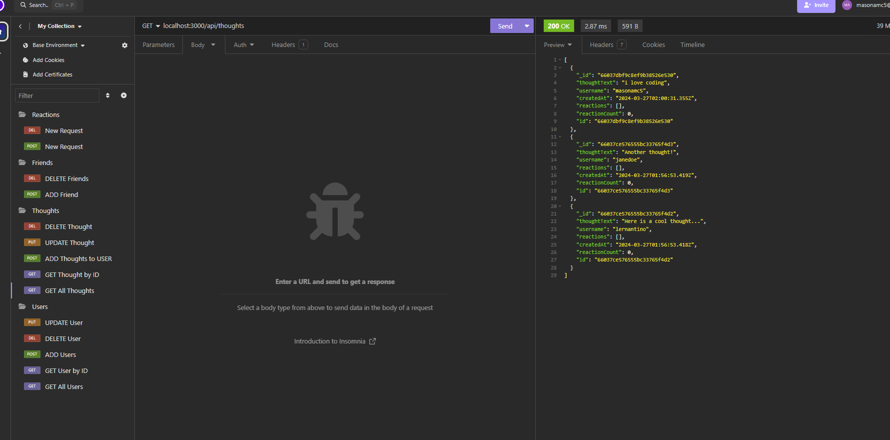

# Social Network Api

## Description

This is a command line app using mongoDB and express mongoose. It allows you to create and manage users. Also able to create thoughts and reaction to others thoughts.

## Table of Contents

1. [Installation](#installation)
2. [Usage](#usage)
3. [License](#license)
4. [Contributing](#contributing)
5. [Tests](#tests)
6. [Questions](#questions)

## Installation

Copy the repo on to your computer and git clone in terminal.

## Usage

Run npm i to install dependencies. Run npm run seed to seed the database. Run npm run dev to start the server.

## License

This project is licensed under the MIT license. See the [MIT License]([License](https://opensource.org/licenses/MIT)) for details.

## Contributing

n/a

## Tests

Test all routes in insomnia

## Questions

For questions about the project, please feel free to contact me via GitHub: [masonamc5](https://github.com/masonamc5) or via email at masonamc5@gmail.com.
